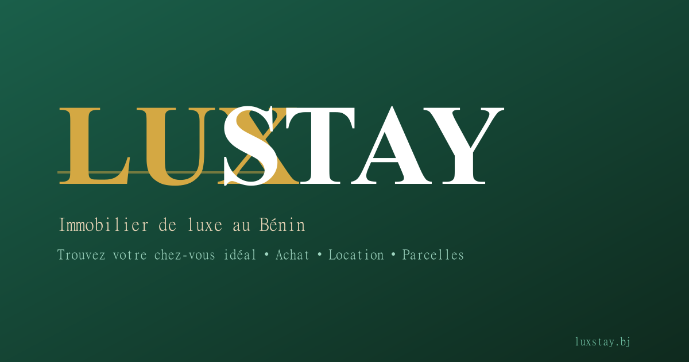

# 🏠 LuxStay - Plateforme Immobilière au Bénin



**LuxStay** est la plateforme immobilière de référence au Bénin. Elle connecte propriétaires, agents immobiliers et acheteurs/locataires dans un environnement sécurisé, moderne et accessible partout.

[](https://nextjs.org/)
[](https://www.typescriptlang.org/)
[](https://www.prisma.io/)
[](https://tailwindcss.com/)
[](LICENSE)

---

## 🚀 Démo

➡️ [https://luxstay-bj.vercel.app](https://luxstay-bj.vercel.app)

---

## ✨ Fonctionnalités

### 🏠 Pour les Acheteurs
- 🔍 **Recherche avancée** avec filtres (type, prix, ville, quartier, chambres)
- 🏘️ **Annonces vérifiées** avec photos, équipements et localisation
- ❤️ **Favoris** pour sauvegarder les biens
- 💬 **Messagerie interne** pour contacter les annonceurs
- 📱 **Contact direct** : WhatsApp, Email, Appel

### 📢 Pour les Annonceurs
- 📝 **Publication d'annonces** avec upload d'images Cloudinary
- 💎 **Plans d'abonnement** : Gratuit (5 annonces), Standard (15), Premium (50), Business (illimité)
- 🚀 **Boosts de visibilité** : Boost, Épinglé, Prioritaire
- 📊 **Dashboard complet** avec statistiques, messages, gestion des annonces
- 🔔 **Emails de confirmation** après chaque paiement

### 👑 Pour l'Administrateur
- 👥 **Gestion des utilisateurs** (blocage, suppression)
- 🏠 **Validation des annonces** (approuver/refuser)
- 💰 **Suivi des paiements** et abonnements
- ⭐ **Modération des avis**
- ⚙️ **Configuration dynamique** de la plateforme
- 📈 **Statistiques globales**

### 💳 Paiements Multi-Modes
- 📱 **Mobile Money** (FedaPay) - MTN, Moov
- 💳 **PayPal** - Carte bancaire directe sans redirection
- ₿ **Crypto** (NowPayments) - BTC, ETH, USDT

### 🤖 Intelligence Artificielle
- 💬 **Chatbot IA** intégré (DeepSeek) accessible sur toutes les pages

---

## 🛠️ Stack Technique

| Couche | Technologie |
|--------|-------------|
| **Frontend** | Next.js 16, TypeScript, Tailwind CSS, Framer Motion |
| **Backend** | Next.js API Routes, NextAuth.js |
| **Base de données** | PostgreSQL (Neon), Prisma ORM |
| **Médias** | Cloudinary |
| **Emails** | Resend |
| **Paiements** | PayPal SDK, FedaPay, NowPayments |
| **Déploiement** | Vercel |
| **Analytics** | Vercel Analytics |
| **Sécurité** | CSP, bcrypt, JWT, XSS Protection |

---

## 📂 Structure du Projet

luxstay/
├── prisma/ # Schéma et migrations
│ ├── schema.prisma # Modèles de données
│ └── seed.ts # Données de test
├── public/ # Assets statiques
│ ├── og-image.png # Image Open Graph
│ ├── favicon.svg # Icône du site
│ └── manifest.json # PWA Manifest
├── src/
│ ├── app/ # Routes Next.js (App Router)
│ │ ├── (public)/ # Pages publiques
│ │ ├── (dashboard)/ # Dashboard annonceur
│ │ ├── (admin)/ # Dashboard administrateur
│ │ ├── api/ # API Routes
│ │ ├── layout.tsx # Layout principal (SEO)
│ │ ├── sitemap.ts # Sitemap dynamique
│ │ └── proxy.ts # Mode maintenance
│ ├── components/ # Composants réutilisables
│ │ ├── layout/ # Navbar, Footer, CookieBanner
│ │ ├── ui/ # Button, Badges
│ │ ├── bien/ # Cartes annonces
│ │ ├── chatbot/ # ChatBot IA
│ │ └── paiement/ # Bouton PayPal Direct
│ ├── lib/ # Utilitaires
│ │ ├── db.ts # Prisma Client
│ │ ├── auth.ts # NextAuth configuration
│ │ ├── utils.ts # Fonctions helpers
│ │ ├── cloudinary.ts # Upload images
│ │ ├── email/ # Templates emails
│ │ └── paiement/ # FedaPay, PayPal, NowPayments, Binance
│ └── types/ # Types TypeScript
├── next.config.ts # Configuration Next.js + CSP
├── tailwind.config.ts # Configuration Tailwind
├── vercel.json # CRON Jobs
├── package.json
└── README.md


---

## 🗄️ Modèle de Données

| Modèle | Description |
|--------|-------------|
| **User** | Utilisateurs (Acheteur, Annonceur, Admin) |
| **Annonce** | Biens immobiliers publiés |
| **Image** | Photos des annonces |
| **Abonnement** | Plans d'abonnement souscrits |
| **Paiement** | Transactions enregistrées |
| **Message** | Messagerie interne |
| **Favori** | Biens sauvegardés |
| **Avis** | Témoignages utilisateurs |
| **Ville / Quartier** | Localisation (17 villes du Bénin) |
| **Signalement** | Annonces signalées |
| **Configuration** | Paramètres dynamiques |

---

## 🚀 Installation

### Prérequis

- Node.js 20+
- PostgreSQL (ou Neon)
- Compte Cloudinary (gratuit)
- Compte Resend (gratuit)
- Comptes PayPal, FedaPay, NowPayments (optionnel)

### Étapes

```bash
# 1. Cloner le projet
git clone https://github.com/josuekelly-droid/luxstay.git
cd luxstay

# 2. Installer les dépendances
npm install

# 3. Configurer les variables d'environnement
cp .env.example .env
# Remplir les clés API dans .env

# 4. Initialiser la base de données
npx prisma db push
npx prisma generate

# 5. Remplir avec les données de test
npm run prisma:seed

# 6. Lancer le serveur de développement
npm run dev

🔐 Variables d'Environnement

# Base de données
DATABASE_URL="postgresql://..."

# NextAuth
NEXTAUTH_SECRET="..."
NEXTAUTH_URL="http://localhost:3000"

# Cloudinary
NEXT_PUBLIC_CLOUDINARY_CLOUD_NAME="..."
CLOUDINARY_API_KEY="..."
CLOUDINARY_API_SECRET="..."

# Resend (Emails)
RESEND_API_KEY="re_..."

# PayPal
PAYPAL_CLIENT_ID="..."
PAYPAL_CLIENT_SECRET="..."
NEXT_PUBLIC_PAYPAL_CLIENT_ID="..."

# FedaPay
FEDAPAY_SECRET_KEY="..."
FEDAPAY_PUBLIC_KEY="..."
FEDAPAY_ENVIRONMENT="sandbox"

# NowPayments (Crypto)
NOWPAYMENTS_API_KEY="..."
NOWPAYMENTS_PUBLIC_KEY="..."
NOWPAYMENTS_IPN_SECRET="..."

# Google OAuth
GOOGLE_CLIENT_ID="..."
GOOGLE_CLIENT_SECRET="..."

# Application
NEXT_PUBLIC_APP_URL="http://localhost:3000"
CRON_SECRET="..."

📊 Scripts Disponibles:

npm run dev:	Démarre le serveur de développement
npm run build:	Build de production
npm run start:	Démarre le serveur de production
npm run prisma:seed	- Remplit la base avec les données de test
npm run prisma:studio	- Ouvre Prisma Studio
npm run prisma:push	- Synchronise le schéma avec la base
npm run prisma:generate	- Génère le client Prisma
npm run db:reset	- Réinitialise la base + seed


🌍 Villes Couvertes:
Cotonou • Abomey-Calavi • Porto-Novo • Parakou • Natitingou • Djougou • Bohicon • Abomey • Lokossa • Ouidah • Grand-Popo • Kandi • Malanville • Dassa-Zoumè • Savalou • Allada • Sèmè-Kpodji


🔒 Sécurité:
✅ Content Security Policy stricte

✅ bcrypt pour le hashage des mots de passe

✅ Prisma ORM contre les injections SQL

✅ JWT pour les sessions utilisateur

✅ X-Frame-Options / XSS Protection

✅ Double confirmation pour les suppressions

✅ Mode maintenance activable en un clic

✅ CRON quotidien pour la gestion des expirations


📱 Responsive Design:
LuxStay est optimisé pour tous les écrans :

📱 Mobile (320px+)

📟 Tablette (768px+)

💻 Desktop (1024px+)

🖥️ Grand écran (1440px+)


👨‍💻 Auteur:
Kelly Josué AKPLOGAN - Fondateur & Développeur Full-Stack

https://img.shields.io/badge/LinkedIn-Kelly_Josu%C3%A9_AKPLOGAN-0077B5?logo=linkedin
https://img.shields.io/badge/GitHub-josuekelly--droid-181717?logo=github


📄 Licence:
Ce projet est sous licence MIT. 


⭐ Soutenir le Projet
Si vous trouvez ce projet utile, n'hésitez pas à :

⭐ Mettre une étoile sur GitHub

🐛 Signaler des bugs

💡 Proposer des améliorations

📣 Partager autour de vous


Fait avec ❤️ au Bénin 🇧🇯

